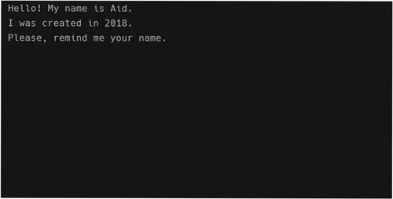

# Simple Chatty Bot
Simple chat bot written in Kotlin

That's a project I've done while learning on [JetBrains Academy][hyperskill]



## Requirements
- Download [JDK][openjdk-14] and extract
- Add JDK `/bin` directory to your PATH

## Usage
- Download [release]
- Run where you placed `SimpleBot.jar`:
```sh
java -jar SimpleBot.jar
```

## Build
- Install [Kotlin compiler][kotlinc], same as JDK (see requirements)
- Run from project directory:
```sh
kotlinc src/bot/SimpleBot.kt -include-runtime -d SimpleBot.jar
```

[openjdk-14]: http://jdk.java.net/14/
[kotlinc]: https://github.com/JetBrains/kotlin/releases/latest
[hyperskill]: https://hyperskill.org/projects/95
[release]: https://github.com/mihael-stormrage/simple-chatty-bot-kotlin/releases
